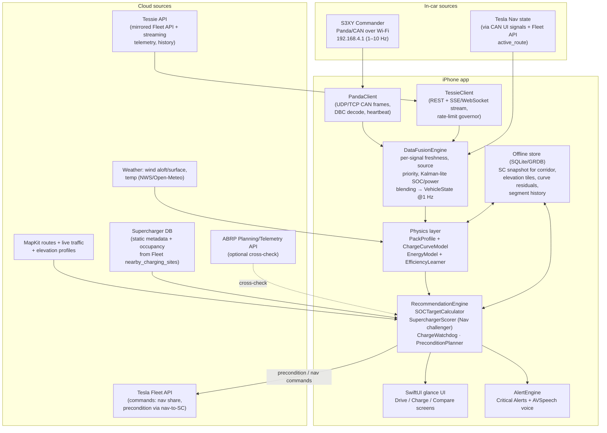

# 2 · System Architecture

## 2.1 High-level data flow

## 2.2 Concurrency shape (Swift Concurrency)

- Every source client is an `actor` owning its connection and publishing an
  `AsyncStream` of typed updates.
- `DataFusionEngine` is an actor consuming all source streams, emitting a
  coalesced `VehicleState` snapshot stream at 1 Hz (and immediately on
  "significant" deltas: charge power step >5 kW, SOC step, thermal flag).
- `RecommendationEngine` consumes fused state; heavy re-planning (multi-stop
  DP over the corridor graph) runs on a detached task with cancellation when
  fresher inputs arrive; the watchdog path is a cheap per-tick computation so
  a stall-underperformance alert is never queued behind a re-plan.
- UI observes `@Observable` view-models fed from the engine's output stream;
  no Combine, no timers in views.

## 2.3 Source priority & degradation matrix

Per-signal priority with freshness windows — fusion picks the freshest
highest-priority source per *signal*, not per source:

| Signal | 1st | 2nd | 3rd | Stale after |
|---|---|---|---|---|
| Pack current/voltage/power | S3XY CAN | Tessie stream (charger_power) | — | 3 s / 15 s |
| Cell temps min/max/avg | S3XY CAN | inferred from Tessie battery_heater + ambient model | — | 5 s / 5 min |
| SOC | S3XY CAN | Tessie | last-known + coulomb-count dead-reckoning | 5 s / 60 s |
| Location/speed | Phone GPS | S3XY CAN | Tessie | 2 s / 5 s / 30 s |
| BMS charge limits | S3XY CAN | — | curve model prediction | 5 s |
| Nav destination / active route | Fleet `active_route` via Tessie | CAN UI signals | manual entry | 60 s |
| Ambient temp | S3XY CAN | Tessie | weather API at location | 60 s / 5 min |

Degradation rules:
- **S3XY Wi-Fi drop** (phone leaves car / Commander sleeps): fusion flips to
  Tessie within one freshness window; watchdog widens its underperformance
  threshold (cloud power readings are coarser and ~10–30 s delayed) and the UI
  shows a source badge (CAN / CLOUD / DR).
- **Tessie rate-limit/outage**: REST governor backs off; streaming keeps
  working independently; if both die, cloud-only signals go to model-predicted
  values with explicit "estimate" styling.
- **Total offline** (I-70 Utah dead zones): decision engine runs entirely on
  the offline store — corridor SC snapshot, cached elevation, last weather —
  and re-syncs on reconnect.

## 2.4 Data models (canonical, full definitions in `Sources/CannonballCore/Models/`)

- **`VehicleState`** — timestamped fusion output: location, speed, heading,
  SOC (indicated), usable kWh remaining, pack V/I/kW, cell temp min/avg/max,
  BMS max charge/discharge kW, precondition status, cabin/ambient temp,
  odometer, per-signal `SourceTag` + age.
- **`Supercharger`** — id, name, coordinate, version (`v2urban|v2|v3|v4stall|
  v4cabinet`), stall count, per-car cap kW, pairing map (V2), highway detour
  seconds (precomputed both directions), amenity flags, occupancy
  (`live(n,total)|predicted(p)|unknown`), historical health score.
- **`ChargeSession`** — site+stall, start/end SOC & time, sample series
  `(t, soc, kW expected, kW actual, tCellMax, limitReason)`, derived: energy
  added, mean power, underperformance ratio, watchdog events.
- **`RouteLeg`** — origin/destination (stop or endpoint), distance, elevation
  gain/loss profile (compressed polyline), forecast wind vector & temp along
  leg, traffic-adjusted drive seconds, predicted consumption Wh/mi ±σ,
  required departure SOC, predicted arrival SOC.
- **`TripPlan`** — ordered legs + charge stops with per-stop target SOC,
  total remaining seconds; two live instances: `teslaNavPlan` (what the car
  intends) and `optimizedPlan` (the app's), plus their delta.

## 2.5 UI surfaces

1. **Drive screen** (default): huge numerals — arrival SOC at next stop,
   minutes to stop, current Wh/mi vs plan, next action ("Precondition in
   14 min", "Stop 7: Effingham V3, arrive 9%, charge 21 min → 62%").
2. **Charge screen** (auto-switches on plug-in): actual kW vs expected-kW
   curve overlay, time-to-target ring, cell temps, **big DEPART AT 62%**
   figure with live countdown, watchdog verdict line.
3. **Compare screen**: Tesla Nav plan vs app plan, per-stop rows and a single
   headline: "**App plan is 11:40 faster**"; one-tap "send to car" (Fleet
   share) for the recommended next stop.
4. **Alerts**: Critical Alerts entitlement + `AVSpeechSynthesizer` voice for:
   stall switch, better-site-ahead, thermal limit, buffer erosion, source loss.

## 2.6 Background & entitlements

- `UIBackgroundModes`: `location`, `audio` (voice guidance keeps the session
  alive legitimately), `processing` + `BGProcessingTask` for re-plans.
- `NSLocationAlwaysAndWhenInUseUsageDescription`; precise location required.
- Critical Alerts requires Apple entitlement approval — request early
  (justification: time-critical charging safety guidance); fall back to
  time-sensitive notifications + voice if not granted by run day.
- Local network usage (`NSLocalNetworkUsageDescription`) + multicast
  entitlement not required for unicast UDP to 192.168.4.1, but the local
  network privacy prompt must be pre-triggered in onboarding.
- Practical reality for the run: phone stays on a mount, plugged in, screen
  on (`isIdleTimerDisabled = true`) — background modes are the safety net,
  not the primary mode.

## 2.7 Tech stack

- Swift 5.10+, SwiftUI, Swift Concurrency (actors, `AsyncStream`), `@Observable`.
- `Network.framework` (`NWConnection`) for Panda UDP/TCP — no third-party dep.
- GRDB.swift for the offline store (SQLite); Codable JSON snapshots acceptable
  for MVP.
- MapKit (`MKDirections` with `requestsAlternateRoutes`, traffic-aware ETAs) +
  a prefetch pipeline for corridor elevation (Open-Meteo elevation or USGS
  tiles cached to the store).
- Open-Meteo / NWS gridpoint forecasts for surface wind + temp along-route
  (free, no key, cacheable) — wind decomposed into head/cross components per
  leg bearing.
- No backend required for MVP (phone-only, offline-first). Optional Phase-3
  helper: a tiny relay (Cloudflare Worker) that polls Tessie/Fleet
  `nearby_charging_sites` on a schedule to build occupancy history — nice, not
  necessary.
